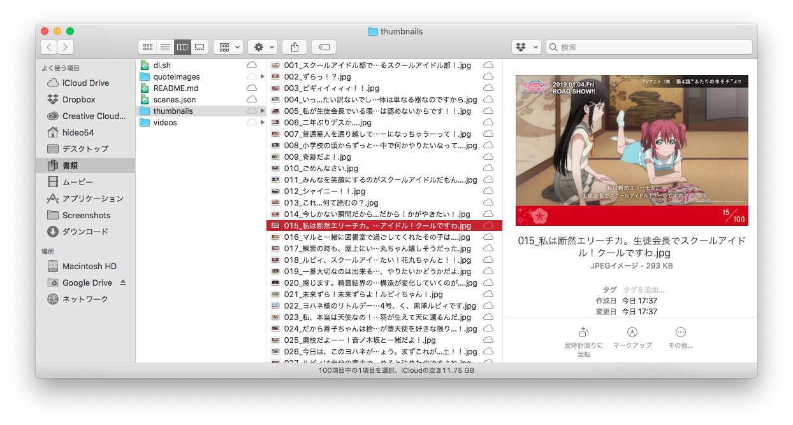

# LoveLiveSunshineMovie

[劇場版「ラブライブ! サンシャイン!!」スペシャルサイト](https://lovelive-sunshinemovie.jp/)で公開されている100の名場面のセリフ画像(計754KB)、シェア用画像(計29.6MB)、動画(計1.23GB)を取得するスクリプトです。

This script is to get quote-images(754KB), thumbnails(29.6MB) and videos(1.23GB) from 100 impressive scenes, which is published on [LoveLive! Sunshine!! The School Idol Movie Special Site](https://lovelive-sunshinemovie.jp/).

## Requirements

* curl
* [jq](https://stedolan.github.io/jq/download/)
* [youtube-dl](https://rg3.github.io/youtube-dl/download.html) (if you want videos)

## How to run

1. 必要なものをすべてインストールする。
1. `./dl.sh` 。希望に合わせてyまたはnを入力。
1. 動画なしの場合はすぐ終わりますが、ありの場合はかなりの時間を要します(私の環境では20分かかりました)。気長に待ちましょう。

en:
1. Install all requirements you need.
1. `./dl.sh` and input `y` or `n` as you like.
1. If you don't want videos, it's almost done. Otherwise it takes a long time (20 minutes in my case). Take a coffee break and wait patiently.

## Contact

* Mastodon: [@hideo54@hideo54.com](https://social.hideo54.com/@hideo54)
* Twitter: [@hideo54](https://twitter.com/hideo54)
* E-mail: contact@hideo54.com
